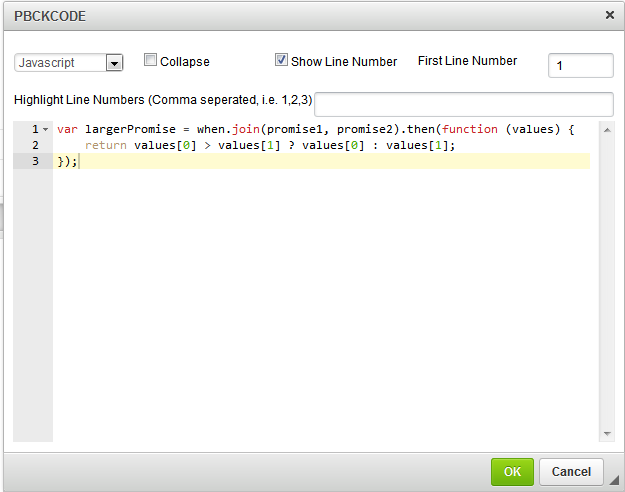
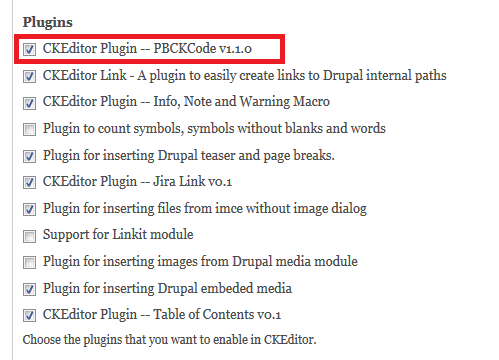
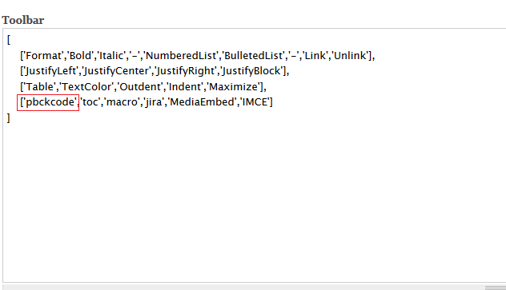
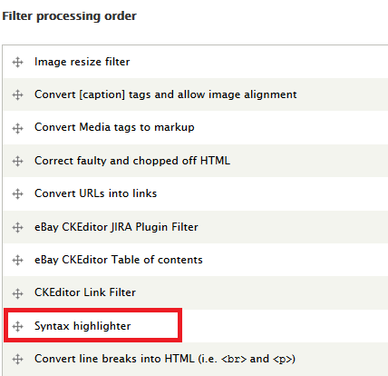

Drupal module based on PBCKCode v1.1.0 plugin. Allow user to insert code blocks in CKEditor in Drupal.

## Dependencies
* [CKEditor](https://drupal.org/project/ckeditor)
* [Syntax Highlighter](https://drupal.org/project/syntaxhighlighter)

## Screenshot

## Usage
Go to "admin/config/content/ckeditor/edit/Basic" to change the profile configuration of CKEditor to use this plugin module.

In "Editor appearance" section, check the "CKEditor Plugin -- PBCKCode v1.1.0" in ***Plugin*** and add "pbckcode" in ***Toolbar***.

The code block in the editor is in a &lt;pre&gt; tag. Thus if you want to change the display in editor, you can define the style in the theme css.
By default, the Syntax Highlighter will be configured to render the code block in a decent way.

Also, the rendered code block is wrapped in the dive with class syntaxhighlighter. You can also put the style in the theme css to define what the code block look like.
