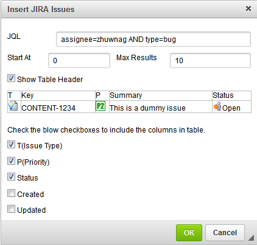
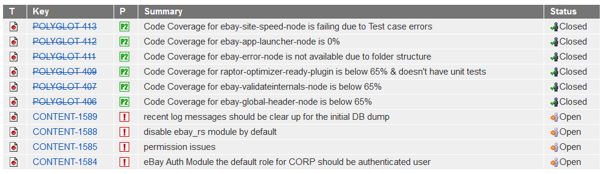
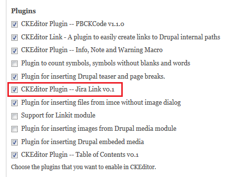
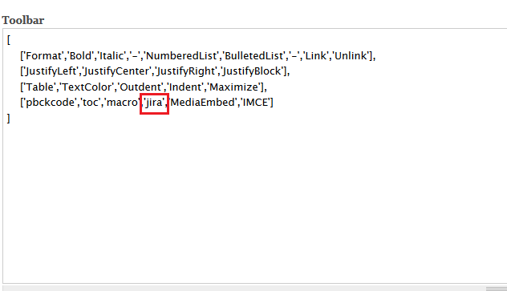
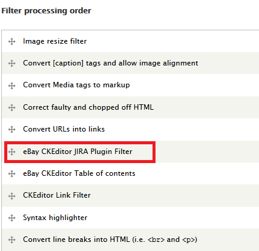

Insert a table of JIRA issues according to JQL in CKEditor in Drupal

## Dependencies
* [CKEditor](https://drupal.org/project/ckeditor)

## Screenshots

### User Interface

### Display in the Editor

### Actual Display

## Usage

Go to "/admin/config/content/ckeditor/edit/Basic" to change the profile configuration of CKEditor to use this plugin module.

In "Editor appearance" section, check the "CKEditor Plugin -- Jira Link v0.1" in ***Plugin*** and add "jira" in ***Toolbar***.

Go to "/admin/config/content/formats" add the filter "eBay CKEditor JIRA Plugin Filter" to a designated Text Format.

The result of the JQL will be displayed as a table while rendering the page. The table has the class name with "jira-table". If you want to have a specific display of a JIRA table, you can set the styles in the theme css to apply to the "jira-table" class.
