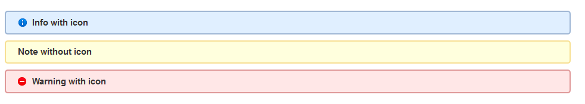

Insert wiki style info, note and warning block in CKEditor in Drupal

## Dependencies
* [CKEditor](https://drupal.org/project/ckeditor)

## Screeshots

### User Interface

### Display
;

## Usage

Go to "admin/config/content/ckeditor/edit/Basic" to change the profile configuration of CKEditor to use this plugin module.

In "Editor appearance" section, check the "CKEditor Plugin -- Info, Note and Warning Macro" in ***Plugin*** and add "macro" in ***Toolbar***.

