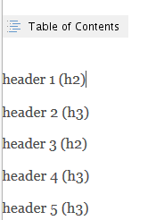
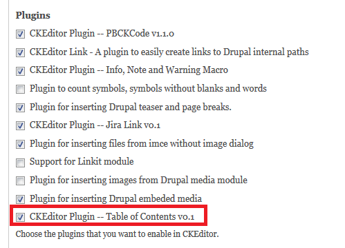
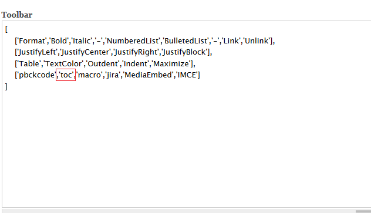
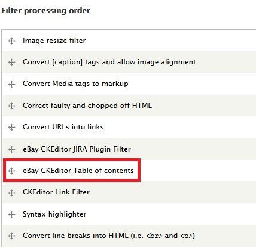
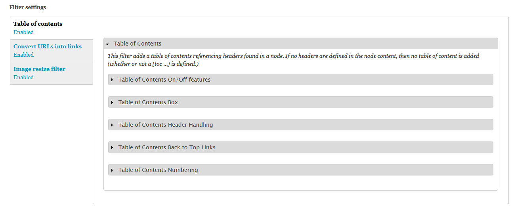

Content filter to create Table of Contents according to "h" tags in the page and replace the "[toc]" string in page to it. Integrate with CKEditor

It supports to replace the simple "[toc]", "[[TOC]]" or "&lt;!--tableofcontents–&gt;" with the real table of contents.
I implemented the ckeditor hook and added the plugin.js for the CKEditor which adds a "Table of Contents" button in CKEditor. 

## Dependencies
* [CKEditor](https://drupal.org/project/ckeditor)

## Screenshots

### Display in the Editor

### Actual Display

## Usage

Go to "/admin/config/content/ckeditor/edit/Basic" to change the profile configuration of CKEditor to use this plugin module.

In "Editor appearance" section, check the "CKEditor Plugin -- Table of Contents v0.1" in ***Plugin*** and add "toc" in ***Toolbar***.

Go to "/admin/config/content/formats" add the filter "eBay CKEditor Table of contents" to a designated Text Format.

Users can click the button to insert "Table of Contents" in content whiling editing.
The button simply insert a image as a placeholder in the editing mode. 
Once the page get rendered, the image will be replaced by real table of contents.
